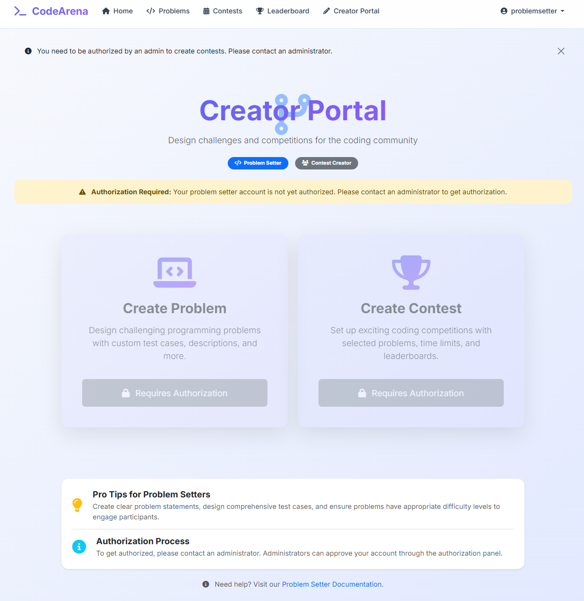

# Online Judge Platform

[](http://3.83.164.20:8000/)
[](https://www.python.org/)
[](https://www.djangoproject.com/)
[](https://www.docker.com/)
[](https://aws.amazon.com/)

A robust, scalable online coding judge platform that allows users to solve programming problems, participate in contests, and improve their coding skills. This platform supports multiple languages, provides real-time feedback, and includes a comprehensive contest management system.

## 🚀 Live Link

The project is deployed on AWS EC2: [CodeAreana](http://3.83.164.20:8000/)

## ✨ Key Features

- **User Authentication & Authorization**: Secure login, registration, and role-based access control
- **Problem Repository**: Extensive collection of coding problems with difficulty levels and categories
- **Multi-language Support**: Code execution for Python, C++, and Java
- **Real-time Code Evaluation**: Secure sandboxed execution with Docker
- **Contest Management**: Create, manage, and participate in time-bound coding contests
- **Leaderboard System**: Track user progress and rankings
- **Problem Creation Portal**: Authorized users can contribute new problems
- **Admin Dashboard**: Manage users, problems, and platform settings
- **AI Assistant** : Built in Assistatant while problem solving for quick help!!

## 🛠️ Technology Stack

### Backend
- **Framework**: Django 5.2
- **API**: Django REST Framework
- **Task Queue**: Celery
- **Message Broker**: Redis
- **Authentication**: Token-based + Session authentication

### DevOps & Deployment
- **Containerization**: Docker & Docker Compose
- **CI/CD**: Automated deployment pipeline
- **Cloud Infrastructure**: AWS (EC2, ECR)
- **Database**: SQLite (Development), PostgreSQL compatible

### Core Components
- **Judge System**: Secure code execution via Docker-in-Docker
- **Async Processing**: Celery workers for non-blocking code evaluation
- **Data Persistence**: Robust database models with proper relationships
- **Security**: CSRF protection, permission-based access control

## Architecture Overview

The application follows a microservice-oriented architecture:

1. **Web Service**: Django application serving the frontend and API endpoints
2. **Redis Service**: Message broker for task queue management
3. **Celery Workers**: Background task processing for code evaluation
4. **Judge Core**: Isolated environment for secure code execution

## 🚢 Deployment Workflow

The platform is containerized and deployed using the following pipeline:

1. **Docker Containerization**: Application packaged into Docker containers
2. **AWS ECR Push**: Container images pushed to Amazon Elastic Container Registry
3. **EC2 Deployment**: Containers orchestrated and deployed on EC2 instances
4. **Networking & Security**: Properly configured security groups and network access

## 📚 Development Environment Setup (To Run in Local Machine)

**Step 0: Start Fresh & Clean Up**

1.  **Close ALL WSL terminal windows.** This is vital to clear any previous environment states.
2.  **Open a brand new WSL terminal.** Your prompt should likely be `sriram@SRIRAM:~$` or `(base) sriram@SRIRAM:~$` if you have Anaconda/Miniconda.
3.  **Navigate to your Django project directory in WSL:**
    ```bash
    cd /mnt/i/Online_Judge
    ```
4.  **Delete any existing virtual environment folder** (e.g., `venv` or `.venv`) to ensure a completely clean start:
    ```bash
    rm -rf venv .venv # This command will remove both if they exist
    ```

-----

**Step 1: Install Necessary System Packages in WSL**

First, ensure your WSL has the tools required for Python virtual environments and Redis.

1.  **Update package list:**
    ```bash
    sudo apt update
    ```
2.  **Install `python3-venv`:** This package provides the `venv` module for creating virtual environments. The error `ensurepip is not available` means this was missing.
    ```bash
    sudo apt install python3.12-venv # Use python3.12-venv 
    # If python3.12-venv is not found, try `sudo apt install python3-venv`
    ```
3.  **Install `redis-server`:** This installs the Redis database server. You confirmed this was missing.
    ```bash
    sudo apt install redis-server
    ```
4.  **Add your user to the `docker` group in WSL:** This allows your user to run Docker commands without `sudo`.
    ```bash
    sudo groupadd docker   # Create the group if it doesn't exist
    sudo usermod -aG docker $USER # Add your user to the group
    ```
      * **After this `usermod` command, you MUST close and reopen your WSL terminal** for the group change to take effect. Do this now before proceeding to Step 2.

-----

**Step 2: Create and Activate Your Project's Virtual Environment**

1.  **Open a NEW WSL terminal.** (After closing and reopening from Step 1).

2.  **Navigate to your project directory:**

    ```bash
    cd /mnt/i/Online_Judge
    ```

3.  **Create the virtual environment:**

    ```bash
    python3 -m venv venv
    ```

    This creates a folder named `venv` inside your `Online_Judge` directory.

4.  **Activate your virtual environment:**

    ```bash
    source venv/bin/activate
    ```

    **VERIFY YOUR PROMPT:** Your terminal prompt **must** now start with `(venv)`, like `(venv) sriram@SRIRAM:/mnt/i/Online_Judge$`. If it doesn't, the virtual environment is NOT active. Stop and troubleshoot this step.

-----

**Step 3: Install Project-Specific Python Packages**

Now that your `(venv)` is active, we'll install Django, Celery, and Redis *into this isolated environment*. This avoids the "externally-managed-environment" error.

1.  **Install Django, Celery, and Redis:**

    ```bash
    python -m pip install Django celery redis
    ```

      * **Why `python -m pip`?** This explicitly tells the `python` executable (which is the one inside your active `venv`) to use *its* `pip` module, ensuring packages go into the virtual environment and bypass system restrictions.
      * Let this command complete. It might take a moment.

2.  **Verify installations (optional, but good for debugging):**

    ```bash
    pip freeze
    ```

    You should see `Django`, `celery`, `redis`, and their dependencies (like `vine`) listed. All these packages are now isolated within your `venv`.

-----

**Step 4: Run Your Services (Each in a Separate WSL Terminal)**

Now you're ready to run all components correctly. You will need three separate WSL terminal windows open.

1.  **Terminal 1: Start Django Development Server**

      * Open a new WSL terminal.
      * `cd /mnt/i/Online_Judge`
      * `source venv/bin/activate`
      * `python manage.py runserver`

2.  **Terminal 2: Start Redis Server**

      * Open another new WSL terminal without any virtual environment or conda env.
      * ```bash
          sudo systemctl start redis-server
        ```
        *If this *still* fails with "Failed to start redis-server.service: Unit redis-server.service not found." (after you installed it with `apt`), then your WSL might not use `systemd`. In that case, run this instead:*
        ```bash
        redis-server
        ```
        *(This terminal will be occupied by Redis).*

3.  **Terminal 3: Start Celery Worker**

      * Open a third new WSL terminal.
      * `cd /mnt/i/Online_Judge`
      * `source venv/bin/activate`
      * **Crucially, use `python -m celery` here:**
        ```bash
        python -m celery -A Online_Judge worker -l info
        ```

This should finally get all your components running correctly without the errors you've been seeing. Take your time with each step, and ensure the virtual environment is always active when installing Python packages or running Django/Celery commands.


# Project Demo Screenshots

Screenshots demonstrating the full workflow of the application, from user registration to contest management and problem solving.

---

### 1. Homepage

*The landing page of the application.*

---

### 2. Sign Up Page

*New users can register here.*

---

### 3. Login Page

*Registered users can log in through this page.*

---

### 4. Profile Page

*User profile displaying details and past activity.*

---

### 5. Problem Solving Interface

*Interface for solving coding problems.*

---

### 6. Problem List

*View all available problems.*

---

### 7. Problem Creation Form

*Form for authorized users to create new problems.*

---

### 8. Unauthorized Problem Setter Portal

*Restricted portal for users not yet authorized to create problems.*

---

### 9. Admin Panel to Authorize Problem Setters

*Admin interface to approve new problem setters.*

---

### 10. Authorized Problem Setter Portal

*Full access portal for verified problem creators.*

---

### 11. Contest Creation – Step 1

*First step in setting up a new contest.*

---

### 12. All Contests Page

*List of all available contests.*

---

### 13. Contest Submission

*Participants can submit solutions during a contest.*

---

### 14. Leaderboard

*Displays contest rankings and user performance.*

---
## VideoDemo:
[Video](https://drive.google.com/file/d/1PV_k9hWe9fec4e2QxhMwzLbD-a-0ROMC/view?usp=drive_link)
---
# Contributing and Support
## 🤝 Contributing

Contributions are welcome! Please feel free to submit a Pull Request.

1. Fork the repository
2. Create your feature branch (`git checkout -b feature/amazing-feature`)
3. Commit your changes (`git commit -m 'Add some amazing feature'`)
4. Push to the branch (`git push origin feature/amazing-feature`)
5. Open a Pull Request


## 🙏 Acknowledgments

- Special thanks to the Django, Celery, and Docker communities for their excellent documentation
- All users who provided valuable feedback during development

---

